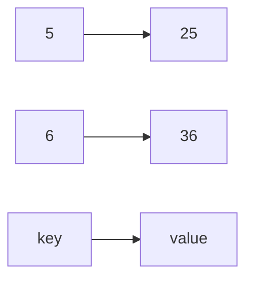

###### Visualising List

``` list = |1|2|3|4|5| ```

- Appending to list

```
list = |1|2|3|5|<-- |8|
list = |1|2|3|5|8|
```

- Element popping

```
list = |1|2|3|5 => 5
elem = 5
```

- Inserting Element

```
Insertin 5 @ index 1

         [5]
          |
list = [1][2][3][4]

list = |1|5|2|3|4|
```

Visualising Dictionary



```mermaid

```

##### Visualising Node

```plantuml
@startuml
    class node{
        data
        next
    }
@enduml
```

###### Visualising Stack pop

```mermaid
flowchart BT
    A[node1] --> C[node2]
    C --> E[node3]
    E --> D[node4]
    D --> |when stack is popep|F[node5]

    H[node5] %% when stack is popep
```

###### Visualising Stack Push

```mermaid
flowchart TB
    A[node6] --> |when node is pushed|C[node5]
    C --> E[node4]
    E --> D[node3]
    D --> F[node2]

    H[node7] %% when stack is popep
```


Visualising Inplace Linked List Reversal


