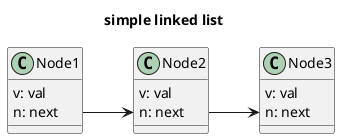
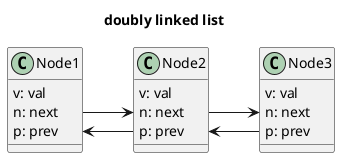
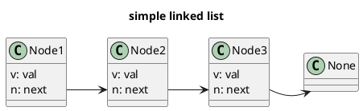
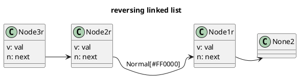
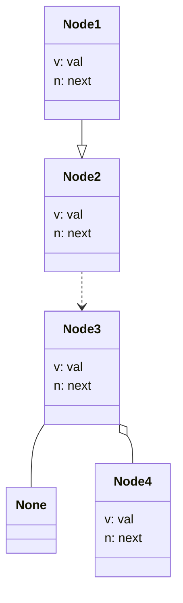

##### Linked List reversal Visuals

```plantuml
@startuml
    title simple linked list

    class Node1 {
        v: val
        n: next
    }
    class Node2{
        v: val
        n: next
    }
    class Node3{
        v: val
        n: next
    }    
    Node1::n -> Node2::n 
    Node2::n -> Node3::n
@enduml
```

```plantuml
@startuml
    title doubly linked list

    class Node1 {
        v: val
        n: next
        p: prev
    }
    class Node2{
        v: val
        n: next
        p: prev
    }
    class Node3{
        v: val
        n: next
        p: prev
    }    
    Node1::n -> Node2::n 
    Node2::p -> Node1::p 
    Node2::n -> Node3::n
    Node3::p -> Node2::p
@enduml
```

```plantuml
@startuml
    title simple linked list
    class None {

    }
    class Node1 {
        v: val
        n: next
    }
    class Node2{
        v: val
        n: next
    }
    class Node3{
        v: val
        n: next
    }    

    Node1::n -> Node2::n 
    Node2::n -> Node3::n
    Node3::n -> None

@enduml
```

```plantuml
@startuml
    title reversing linked list
   class Node1r {
        v: val
        n: next
    }
    class Node2r{
        v: val
        n: next
    }
    class Node3r{
        v: val
        n: next
    }    

    Node2r::n -> Node1r::n : Normal[#FF0000]
    Node3r::n -> Node2r::n
    Node1r::n -> None2
@enduml
```

```mermaid
classDiagram
    class None {

    }
    class Node1 {
        v: val
        n: next
    }
    class Node2{
        v: val
        n: next
    }
    class Node3{
        v: val
        n: next
    }    
    class Node4{
        v: val
        n: next
    }
    Node1 --|> Node2 
    Node2 ..> Node3
    Node3 -- None
    Node3 o-- Node4
```
